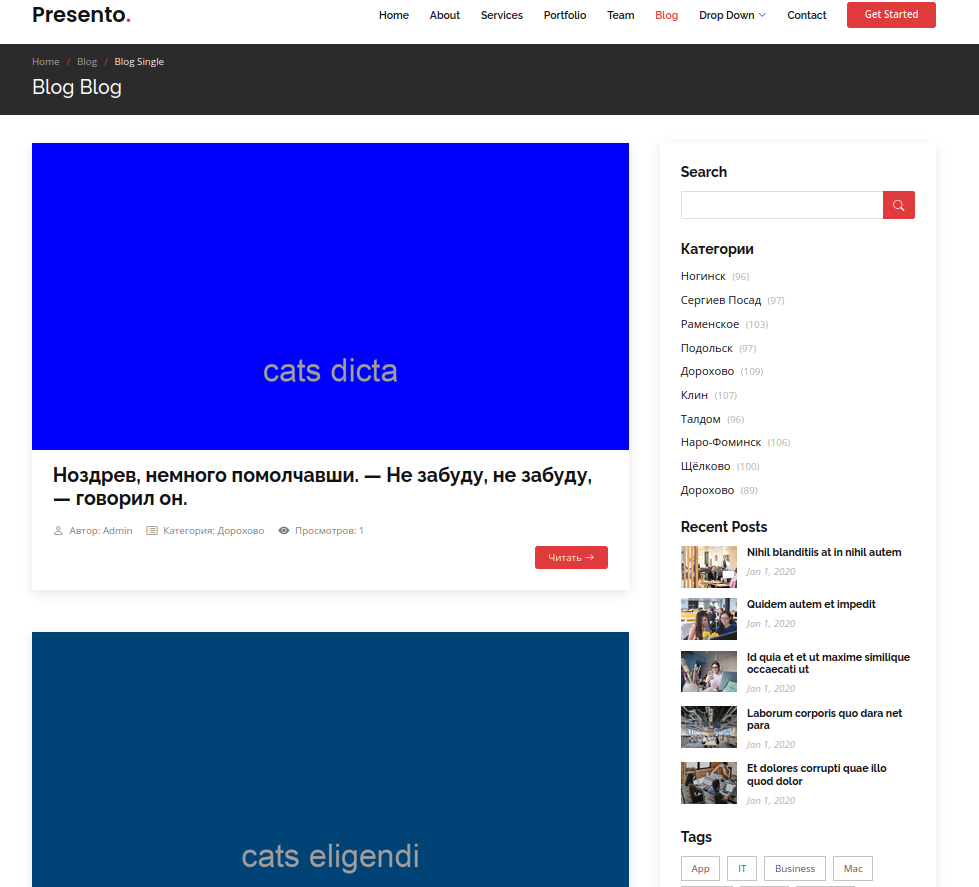

# Блог на Laravel 10

## Содержание

[1. Установка и базовая настройка](docs/install.md)

[2. Создание моделей и миграций](docs/model_and_migration.md)

[3. Фабрики и сиды](docs/seed_and_factoris.md)

---

[Время чтения поста – расчет и реализация](docs/post_reading_time_calculation_and_implementation.md)

[Автоматическое увеличение счётчика просмотров через Event (События)](docs/visit_count_post.md)