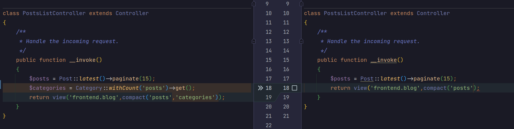

# Передача данных во все представления в Laravel 

Для совместного использования общих переменных или данных во всех представлениях, не передавая их в каждое представление вручную.

Это может быть полезно, если вам нужно установить общие данные, в нашем случае это список категорий и список последних постов (они отображаются на всех страницах фронтенда ).

## Использование View Composer

Компоновщики представлений предоставляют более гибкий подход к передаче данных в представления. Вот как их использовать:

Создайте новый View Composer, выполнив в терминале следующую команду: 

```bash
php artisan make:provider FrontViewServiceProvider
```

Откройте вновь созданный файл app/Providers/FrontViewServiceProvider.php

в boot метод, добавьте следующий код: 

```php
<?php

namespace App\Providers;

use App\Models\Category;
use App\Models\Post;
use Illuminate\Support\Facades\View;
use Illuminate\Support\ServiceProvider;

class FrontViewServiceProvider extends ServiceProvider
{
    /**
     * Register services.
     */
    public function register(): void
    {
        //
    }

    /**
     * Bootstrap services.
     */
    public function boot(): void
    {
        //$categories = Category::withCount('posts')->get();
        View::composer('frontend.partials.sidebar',function ($view){
            $view->with('categories', Category::withCount('posts')->get());
            $view->with('recent_posts', Post::latest()->limit(5)->get());
        });
    }
}
```

Открыть config/app.php и добавим наш кастом FrontViewServiceProvider, как показано ниже: 

```php
    /*
    |--------------------------------------------------------------------------
    | Autoloaded Service Providers
    |--------------------------------------------------------------------------
    |
    | The service providers listed here will be automatically loaded on the
    | request to your application. Feel free to add your own services to
    | this array to grant expanded functionality to your applications.
    |
    */

    'providers' => ServiceProvider::defaultProviders()->merge([
        /*
         * Package Service Providers...
         */

        /*
         * Application Service Providers...
         */
        App\Providers\AppServiceProvider::class,
        App\Providers\AuthServiceProvider::class,
        // App\Providers\BroadcastServiceProvider::class,
        App\Providers\EventServiceProvider::class,
        App\Providers\RouteServiceProvider::class,
        \App\Providers\FrontViewServiceProvider::class,// <- add new
    ])->toArray(),
```

Теперь в методах наших контроллеров мы можем удалить передачу категорий и последних постов в представление.



 [К содержанию](../README.md)