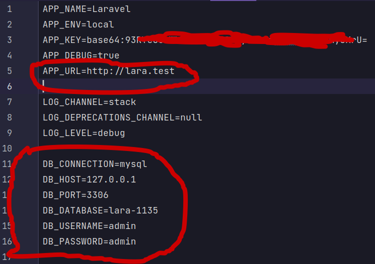

# Установка и базовая настройка

Создаём новый проект Laravel напрямую с помощью Composer.

**example-app** название папки проекта

```bash
composer create-project laravel/laravel:^10.0 example-app

cd example-app
```

Ставим [**Debugbar for Laravel** ](https://github.com/barryvdh/laravel-debugbar)

```bash
composer require barryvdh/laravel-debugbar --dev
```
Устанавливаем [**IDE Helper Generator for Laravel**](https://github.com/barryvdh/laravel-ide-helper)

```bash
composer require --dev barryvdh/laravel-ide-helper
```
В файле **.env** настраиваем подключение к Mysql и домен сайта



[К содержанию](../README.md)